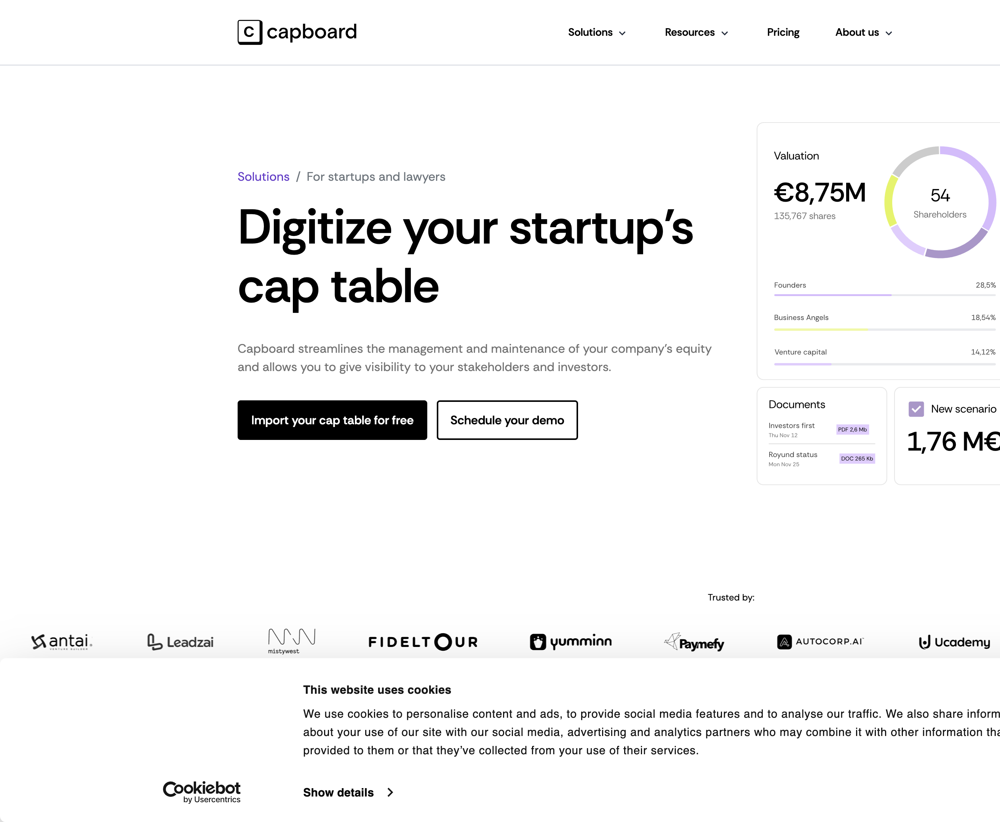

# Capboard — Deep Dive

**Service:** https://www.capboard.io/en/ · **Researched:** 2026-06-11 (agent deep-dive, cited) · Part of the 12-service competitive survey — see [INDEX.md](INDEX.md).

---

**Research value: high** — Substantial concrete detail on Capboard's modules, pricing model, simulation UX, and EU positioning, directly mappable to Comp Studio workstreams.

# Capboard (capboard.io) — Research Digest

## Positioning & Pricing
- **Spanish-rooted, EU-first** equity-management SaaS for pre-seed→Series C; competes hardest on price vs Carta ($6+/stakeholder/mo) and Ledgy (€3K–6K/yr tiers). Bilingual EN/ES support; UI in ES/FR/DE/EN; multi-currency; GDPR, SSO, 2FA. Positioned as "all essentials, one-third the price" (Waveup 2026: "cheapest serious option in the EU bracket").
- **Pricing (Dec 2024 model, verified Apr 2026):** single all-features "Stakeholder" plan — **$2/stakeholder/mo annual ($4 monthly), $360/yr minimum covering 15 stakeholders**; "Scale-up" custom flat fee for 75+ stakeholders (adds self-hosting, whitelabel, custom SSO). Add-ons: premium support $50/mo, onboarding $300 one-time, 409A via partner $1,800. **Free tier**: cap-table builder + PDF/Excel export free under 25 shareholders (Waveup says no *standing* free product tier — the free tools are lead-gen calculators); 14-day trial. External collaborators (lawyers) don't count as billable stakeholders.

## Feature Inventory (by module)
- **Cap table:** transaction-event model (rounds, SAFEs/convertibles, splits, reverse splits, secondaries); history/time-travel; unlimited share classes with votes, liquidation pref (multiple + numeric seniority field: senior/pari passu/junior), anti-dilution; authorized-shares tracking; "Cap Table by Share Class" view (authorized / non-diluted / fully-diluted / investment columns, June 2024); auto-generated share certificates; option to hide valuation from shareholders.
- **ESOP/equity comp:** pools, grants for stock options, **phantom shares**, SARs, warrants; vesting schedules with reminders; exercise + post-termination exercise period (PTEP); **automated grant letters from templates** (or upload own); grants CSV export; employee self-serve portal showing real-time vested value.
- **Fundraising/scenario:** private simulations stacking multiple transactions; dilution + voting-rights projection; exit-payout calculation per shareholder/employee incl. carve-outs; duplicate/compare/**apply** simulations into the live cap table.
- **Investor relations:** unlimited email updates with engagement tracking (opens, clicks, read time); metrics reporting; portfolio view for investors.
- **Governance:** **board management** (members, communications, meetings) + **shareholder meetings with automated document generation and built-in e-signature** — bundled in the base plan.
- **Documents:** virtual data room with permission engine, per-document visit tracking, contract templates (SAFE, ESOP), own e-signature solution.
- **Valuations:** unlimited valuations recordable on the cap table; 409A via US partner ($1,800), not bundled; no EU-equivalent valuation product surfaced.
- **Audit:** admin change tracking + access/view monitoring history ("we keep a history of what users have seen or accessed").

## Key Workflows & UI/UX
- **Navigation:** left sidebar — Ownership (Cap Table / Simulations sub-sections), Stakeholders, Documents; tab-like sub-sections within Simulations (Cap Table, Transactions).
- **Simulation flow:** "+ Create Simulation" (top-right) → add transaction → "Generate Cap Table" → "Save Simulation" → "Ownership Evolution" button shows dilution across holders → three-dots menu per simulation: Duplicate / **Apply** (promote draft to recorded reality) → **cap-table version selector** to compare scenarios.
- **Sharing/export:** top-right "Share" button on cap table → PDF / Excel / email-invite; stakeholder book download; open CSV/Excel export everywhere (marketed as "AI-ready" — pipe exports to ChatGPT/Sheets).
- **Charts:** ownership pie/distribution charts, share-class visual charts, ownership-evolution (dilution-over-time) view; data-dense tables dominate.
- **Onboarding:** 25-step self-serve flow; **24/7 AI voice onboarding assistant (VoiceB.ai) by phone in EN/ES** + Intercom Fin AI resolving ~70% of support tickets; refreshed UX/UI redesign late 2024.
- **Roles:** founders (full), investors/advisors (own holdings), employees (own grants only), collaborators (all but billing).

## Review Sentiment
- **G2 4.7/5** (only 3 reviews — thin base); Capterra ~4.7/5; Tekpon 4.3/5; AccurateReviews scores usability 7.5, pricing 5/10. Quotes: "Outstanding customer support, I use it almost every day" (G2); "automating grant letters, vesting schedules, and keeping our employees informed about their equity value in real-time" (site testimonial). Third-party cons: smaller US footprint / law-firm reconciliation friction, "feature depth may differ from enterprise competitors," less known in US, no bundled 409A.
- **2025–26 shipped:** AI onboarding/support stack, PTEP, reverse splits, authorized shares, share-class view, stakeholder-book download, per-stakeholder pricing migration, "AI-ready" open-export positioning.

## Takeaways for Comp Studio
1. **(WS-C feedback/undo)** Capboard's draft→apply simulation lifecycle (private sims, Duplicate, explicit Apply with all transactions recorded) is the strongest pattern here: scenario cases in Comp Studio should keep a visible draft/applied boundary with an explicit promote action, never silent mutation.
2. **(9c sealed versions / 9a provenance)** Their audit posture is access-logging ("history of what users have seen") + admin change tracking — but no immutable sealed snapshots. Comp Studio's sealed proposition versions go further; the differentiating bit worth borrowing is logging *views* as well as edits for confidential figures.
3. **(WS-F charts / 9e vesting timeline)** "Ownership Evolution" as a one-click dilution-over-time view attached to every simulation validates Comp Studio's DilutionPath; Capboard's version selector for side-by-side scenario comparison maps to scenario-set switching — a compact version-picker beats parallel panes.
4. **(WS-G info design / 9d formula inspectability)** Capboard wins reviews on *table* clarity (share-class view with authorized/non-diluted/fully-diluted/investment columns), not formula transparency — payout math is a black box behind "Generate Cap Table." Comp Studio's inspectable engine math is a genuine differentiator; surface it.
5. **(WS-B dialogs / 9b band placement)** Liquidation-pref seniority is configured via a raw numeric field in an edit-share-class dialog — widely documented as confusing enough to need an FAQ. Avoid bare numeric ordering inputs in governance dialogs; use ordered drag lists or labeled presets, and pair every band/anchor input with inline explanation (their grant-letter-from-template flow is the model: defaults + escape hatch).

## Sources
- https://www.capboard.io/en/ — homepage, modules, testimonials
- https://www.capboard.io/en/pricing/ — plan contents, add-ons, roles/permissions FAQ
- https://www.capboard.io/en/captable/ — cap table + exit simulation marketing
- https://www.capboard.io/en/captable/create — free cap-table builder terms
- https://www.capboard.io/en/capboard-new-pricing-dec-2024 — 2025 pricing + feature ship list
- https://www.capboard.io/en/faq/how-to-create-a-simulation — simulation workflow steps
- https://www.capboard.io/en/faq/how-to-use-virtual-data-room — VDR + share/export flow
- https://www.capboard.io/en/seniority-in-liquidation-preference — seniority config UX
- https://www.capboard.io/en/capboard-vs-carta-competitor-differences and /capboard-vs-ledgy-startup-equity-management-choice — vendor comparisons (self-serving)
- https://www.capboard.io/en/capboard-releases-cap-table-updates — June 2024 share-class view
- https://www.capboard.io/en/ai-onboarding-assistant-capboard and /ai-sales-support-capboard-voiceb-intercom — AI onboarding/support (2025)
- https://www.capboard.io/en/ledgy-carta-pulley-alternative-affordable-ai-equity-management — €270/yr + AI-ready export positioning
- https://waveup.com/blog/best-cap-table-management-software/ — independent 2026 comparison (EU positioning, pricing verification)
- https://tekpon.com/software/capboard/reviews/ — feature list, 4.3/5
- https://startupik.com/capboard-equity-management-software-for-growing-companies/ — hands-on review, pros/cons
- https://www.accuratereviews.com/finance-management-software/capboard-review/ — scored review

---

## Hands-on browser evidence (2026-06-11)

*Product mock on the cap-table page: valuation donut (€8,75M · 54 shareholders) + stakeholder-class percentage bars (Founders/Business Angels/VC), documents card, and a "New scenario 1,76M€" simulation card. Solutions nav confirms the module map: Cap table, Equity plans, Simulations, Investor relations, Board meetings, VDR, Equity timeline, ESOP visibility — plus Advisory shares and Employee equity communication as dedicated features.*
