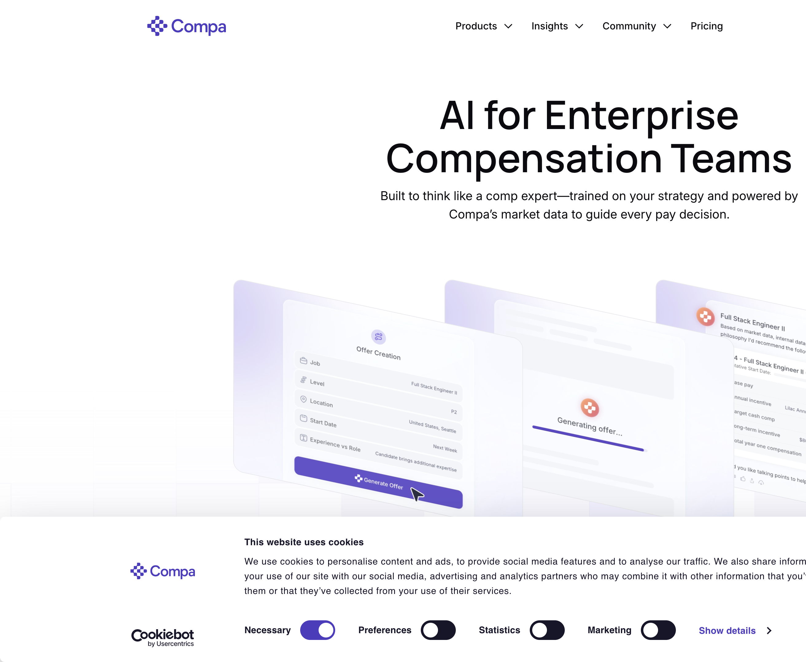

# Compa — Deep Dive

**Service:** https://www.compa.ai · **Researched:** 2026-06-11 (agent deep-dive, cited) · Part of the 12-service competitive survey — see [INDEX.md](INDEX.md).

---

**Research value: high** — Compa is exceptionally well-documented prior art for "market data at the moment of the pay decision," with named mechanisms (offers-based benchmarks, hallucination guard + citations, policy-as-guardrails agents) directly relevant to Comp Studio workstreams.

# Compa (compa.ai) — Deep Dive, June 2026

## Positioning & pricing
- **What it is in 2026:** "AI for Enterprise Compensation Teams" — a compensation-intelligence platform combining a real-time, offers-based market-data network with two AI agents. Evolved from 2021–22 "deal desk for recruiting / offer management" (Compa Offers) → 2023 "offers-based market data" (Compa Index) → 2025–26 agentic platform. Founded 2020 by Workday/Meta alumni (Charlie Franklin CEO, ex-Workday/Mercer comp leader); HQ Newport Beach, CA.
- **GTM:** enterprise-only, quote-based pricing, no free trial, sales-led (explicitly no mid-market/startup tier). Customers: OpenAI, Micron, Airbnb, NVIDIA, Stripe, Block, DoorDash, Autodesk, Marvell, Instacart; "Fortune 50" and "Magnificent 7" logos cited. Workday Platinum/Certified partner (agents registered in Workday's ASOR framework; live in <30 days); also Greenhouse, Oracle, Carta, E*TRADE integrations; WTW data partnership.
- **Funding:** $3.9M seed (Aug 2021, Base10) → $10M Series A (Jan 2024, Storm Ventures) → **$35M Series B (Jan 26, 2026, Jump Capital)**; ~$52M total. SOC 2 Type II, CCPA/GDPR.

## Feature inventory (by module)
- **Data network ("Live Market Data")** — five datasets: **Offers, Employees, Stock (grant-level), Skills, Frontline**; 9M+ observations, 1.5M+ verified offer records, 50+ countries, 6 industries. Give-to-get model: ATS/HCM/stock-admin systems auto-contribute; **refreshed biweekly**. Job matching to Compa's standard career architecture (job codes/titles/descriptions + outlier-detecting data-science layer; one-click match confirm/change). Custom peer groups; skills-based benchmarking; "Market Preview Jobs" extend coverage where offer volume is thin. Tracks accepted **and rejected** offers, acceptance/decline rates.
- **Analyst Agent** (for comp teams) — virtual comp-analysis workspace: benchmark roles, model scenarios, build pay ranges, exec-ready reports. Features: company-context embedding ("like onboarding your next comp executive"), one-click data imports (HRIS, internal ranges, survey data), **Playbooks** (step-by-step guides for leveling a role, benchmarking pay, modeling equity), **Accuracy stack: Hallucination Guard (real-time response checker) + citations linking every answer to source data + "detailed view" showing tools used and data pulled per step**.
- **Partner Agent** (for recruiters/HRBPs/managers, configured by comp) — encodes comp philosophy, ranges, geo rules, incentive/equity policies once; answers comp questions in-policy in seconds; builds hiring briefs, drafts offers, generates negotiation talking points; **auto-approves in-policy offers, flags exceptions for review**; logs prompts/recommendations/approvals/spend. Recruiter interactions become feedback data (competing offers, range pressure detection).
- **Offers (legacy module, still sold)** — offer-workflow automation, policy enforcement, spend control, win/loss (acceptance/decline) analytics. **Watchlist** — continuous monitoring of selected roles/pay movements with alerts.

## Key workflows
1. **Offer construction:** recruiter asks Partner Agent → pre-approved range + policy guidance + market position → drafts offer → in-policy auto-approval or exception routed to comp; every decision documented.
2. **Pre-sourcing calibration:** define target ranges from market + peer + internal data before a req opens.
3. **Market-shift detection:** biweekly offer data + Watchlist surface volatility in emerging roles (AI eng) before hiring stalls; "compensation triggers" guide when to act.
4. **Range maintenance:** decline-rate analytics → adjust bands.

## UI/UX documentation
- **Decision-moment embedding (the headline pattern):** inside Workday's *Make Offer*, *Change Job*, and pay-review screens, Compa benchmarks render in context — e.g., **a flag appears right in the workflow when an employee sits below the 25th percentile**, "no extra steps." Market data surfaces *at* the decision, not in a separate BI tool.
- **Agent UX:** chat/prompt-driven workspace ("drop in a prompt, get a sharp starting point, refine"); every response carries citations to source data plus an expandable trace of tools/data used — provenance as a first-class UI element.
- **Data UI:** "employee cash, grant-level stock comp, and latest offer data visualized on your screen"; percentile-vs-band comparisons; match review is one-click. No public self-serve demo; UI evidence comes from product pages, the Workday-integration post, and recurring live demo webinars (e.g., "Platform Demo: Data Readiness = AI Readiness," Apr 2026 — registration-gated).

## Review sentiment
No meaningful G2/SourceForge review base (enterprise sales-led; SourceForge listing has zero reviews). Signal is curated testimonials: "mind-blowing… multi-billion dollar decisions with the highest degree of confidence" (Mag-7 comp leader), "I use Compa more than survey data," Micron praising live offers over "aged survey data," Workday comp directors on Analyst Agent. HRE "Top HR Product 2022." Third-party roundups note weaknesses: **enterprise-only, limited merit-cycle and pay-equity functionality** vs. full comp-planning suites.

## Data model & provenance story (the differentiator)
Offer-level **transaction data** ("like the housing market — pure signal") vs. survey **stated data**: auto-extracted from ATS/HCM/stock systems, verified, leveled to a common architecture, aggregated (no individual-offer sharing, no crowdsourcing), biweekly refresh vs. 6–12-month-old survey books, includes rejected offers (true market-clearing signal). Provenance is productized: verified-source labeling, citations, response tracing.

## Takeaways for Comp Studio
1. **(WS-C — feedback at decision moment):** Compa's core pattern is benchmark-in-the-flow: the market comparison (e.g., "below P25") renders inside the offer screen itself, with zero navigation. Comp Studio's scenario editor should surface band/benchmark position inline as inputs change, not on a separate analytics view.
2. **(WS-G — guardrails):** Their guardrail grammar is *policy-as-rules + auto-approve in-policy / flag exceptions + log everything*. Generosity guardrails should behave the same way: silent when within policy, explicit flagged exception (with documented rationale) when breached — not a hard block.
3. **(9a — benchmark provenance):** Compa makes provenance a UI feature: every figure is cited to its source, freshness is explicit (biweekly refresh date), and "verified" vs. "preview" data is labeled. Comp Studio's benchmark anchors should carry source + as-of date + confidence tier visibly on the anchor chip, not in a footnote.
4. **(9b — band placement):** Their placement vocabulary is percentile-vs-market (P25 flags, range position) plus acceptance/decline outcomes as band-validation feedback. For advisor grants, the analogue is anchoring proposed packages against value-band percentiles and recording accept/decline outcomes per scenario to recalibrate bands.
5. **(General):** Compa ships "Playbooks" — guided step-by-step flows for recurring comp tasks (level a role, model equity). A lightweight guided flow for "draft an advisor proposition" would mirror this and reduce free-form modeling errors.

## Sources
- https://www.compa.ai/ — homepage: agents, data network, integrations, testimonials
- https://www.compa.ai/blog/compa-raises-35m-series-b-to-accelerate-ai-for-enterprise-compensation — Series B (Jan 2026)
- https://www.compa.ai/offers — Offers module
- https://www.compa.ai/partner-agent — Partner Agent features/approvals
- https://www.compa.ai/analyst-agent — Analyst Agent, Hallucination Guard, citations, Playbooks
- https://www.compa.ai/how-it-works/data-matching — data sources, biweekly refresh, matching
- https://www.compa.ai/blog/compas-live-data-network-is-now-available-in-workday-hcm — in-workflow UI (P25 flag, Make Offer)
- https://www.businesswire.com/news/home/20230517005024/en/... — Compa Index launch (offers-based data model)
- https://compapeergroup.substack.com/p/introducing-compa-index — CEO on give-to-get network, privacy
- https://www.businesswire.com/news/home/20240129797434/en/... — Series A, customer list
- https://www.compa.ai/events/compa-platform-demo-data-readiness-ai-readiness — platform demo webinar (Watchlist)
- https://getstello.ai/10-best-compensation-planning-software-for-2026/ + https://peopleopsclub.com/software/compa — third-party positioning/pricing/weaknesses
- https://www.cbinsights.com/company/compa — total funding ($52.1M)
- https://sourceforge.net/software/product/Compa/ — legacy deal-desk positioning, zero reviews

---

## Hands-on browser evidence (2026-06-11)

*2026 positioning live: "AI for Enterprise Compensation Teams" with the agentic offer-creation UI — an Offer Creation form (Job/Level/Location/Start Date/Experience vs Role) → "Generate Offer" → "Generating offer…" → a generated offer panel with talking points. Prompt chips: Hiring Brief, Offer Creation, Ask About Comp, Offer Visualization.*
