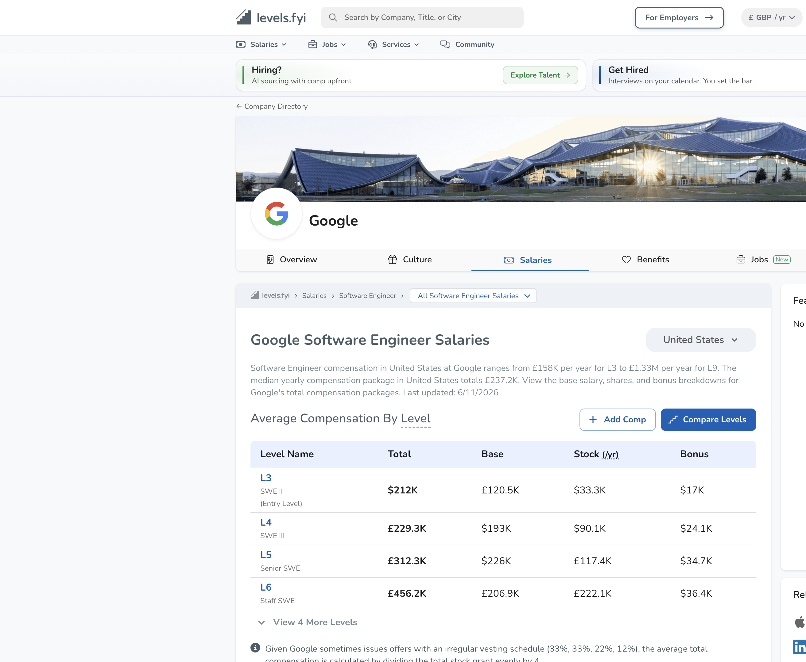
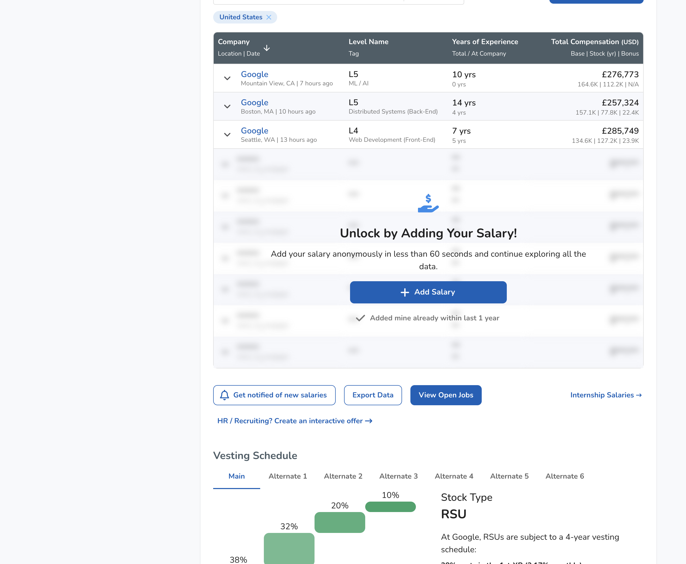

# Levels.fyi — Deep Dive

**Service:** https://www.levels.fyi · **Researched:** 2026-06-11 (agent deep-dive, cited) · Part of the 12-service competitive survey — see [INDEX.md](INDEX.md).

---

**Research value: high** — Levels.fyi is fully public and well-documented; concrete UI grammar, verification tiers, and B2B pricing were all directly observable and map cleanly onto WS-G, 9a, and 9b.

# Levels.fyi — Deep-Dive Research Digest

## Positioning & monetization
- **Positioning:** "Get Paid, Not Played" — the de facto standard for big-tech comp transparency since 2017. Bootstrapped (no VC, ~21–50 staff, Cupertino), ~2–2.4M visits/month (early 2026), ~3:46 avg session. Revenue estimates ~$2.8M/yr.
- **Two-sided model** (founder-confirmed in their community): candidate side = negotiation coaching (paid 1:1, "a few hundred USD", fueled directly by their data) + resume review; employer side = data/benchmarking, employer branding/job board ($0/$1k/$2k per mo tiers: promoted jobs, "Actively Hiring" badge, culture tab, talent pool), and **Interactive Offers** (SOC 2 Type II, ATS-integrated digital offer letters with equity-scenario modeling, commission modeling, custom domains; tiered by license count).
- **Levels.fyi for Teams / Benchmark:** $800/mo (Plus: realtime percentiles by title+location, export by level, view by Levels.fyi standard leveling, 2 licenses) → $2,000/mo (Premium: Data Stream w/ 3-mo history, custom peer cuts, single-company filters, individual data-point granularity, view by *your* leveling framework, competitive-intelligence dossiers, data scientist) → $4,000/mo (Enterprise: 15-mo history, custom TC formulas, view by *other companies'* frameworks, **MCP/API access**). Premium+ ships via Google Sheet including a **"Skill Index" 0–100** numeric codifying level/scope/responsibility — their leveling normalization made into a scalar. Also: benefits benchmarking (Flex Index partnership) and public embeds (salary-range chart embed + leveling embed, 85+ companies, URL-parameterized).

## Feature inventory
1. **Crowdsourced comp database** — 300k+ salaries; per company × role × level × location; median, 25/75th percentiles, distributions.
2. **Level-mapping tables** — the founding feature: side-by-side company ladders with equivalent levels vertically aligned (Google L4 ↔ Meta E4 ↔ Amazon SDE II), per job family; abstracted into a proprietary "Levels.fyi leveling standard" hierarchy based on scope of impact, YoE, responsibility.
3. **Pay heatmaps** (US/Europe/Canada/India) — interactive ZIP-code choropleth, percentile selector (10/25/50/75/90), color-scheme picker, click-in for area percentiles, TC component breakdown, top-paying companies; COL toggle for take-home comparison.
4. **Company pages** — salaries per level, benefits page, leveling, culture tab, jobs, **vesting-schedule cards** (see below).
5. **Salary calculator / side-by-side compare** with FX, tax, COL adjustments.
6. **Verified offers / Salary Stream** — weekly email digest of verified salaries with per-package breakdown analysis.
7. **Internships data**, annual End-of-Year Pay Report, community forum (~950k members), job board.

## Key workflows
- **Submission ("Add Salary," <60s claimed):** anonymized form at `/salaries/add`; optionally attach proof (offer letter, W-2, pay stub) or verify corporate email. **Give-to-get gating:** the latest-submissions table is blurred/asterisked until you add your own salary ("Added mine already within last 1 year" escape hatch).
- **Benchmark lookup:** company → role → level page; filter by YoE, years-at-company, location, date; per-level pages exist (e.g. `/company/Google/salaries/Software-Engineer/L3/`).
- **Negotiation:** data → guide → paid coach; their negotiation-service data feeds back into the verified tier.

## UI/UX documentation (concrete, from the live Google SWE page)
- **Per-level summary table:** columns `Level Name | Total | Base | Stock (/yr) | Bonus` — one row per level (L3 $212K = $161K/$33.3K/$17K … L6 $611K), with a parallel column of **human-readable level aliases** ("SWE II (Entry Level)", "Senior SWE", "Staff SWE"); "View 4 More Levels" progressive disclosure; twin CTAs "Add Comp" / "Compare Levels" above *and* below the table.
- **TC breakdown grammar:** everywhere TC = Base + Stock(annualized over vest) + Bonus; stacked horizontally in tables, stacked-bar in charts. Signing bonus amortized. Single normalized unit ("TC") is the comparison currency.
- **Level-comparison grammar:** company ladders rendered as adjacent columns; equivalent levels row-aligned via the internal standard; levels with no counterpart span/offset. Exposed as an embeddable widget (`compare=` up to two companies, `track=` job family).
- **Freshness/trust labeling:** page header states "Last updated: 6/11/2026"; every submission row carries `Location | Date`; verified entries flagged; report tables show medians with sample-size caveats ("smaller sample sizes → high-level trends only").
- **Vesting visualization:** "Main" + up to 6 "Alternate" schedules as year-by-year percentage bars (38/32/20/10) with prose explanation, stock-type chip (RSU/"GSU"), monthly-vs-quarterly granularity notes.
- **Globalization controls:** currency (10+), number display (Standard vs Indic lakh), annual/monthly toggle — persistent site-wide.
- Notable: they publish **structured `.md` endpoints + llms.txt for AI agents**, with mandatory attribution.

## Data methodology & trust
- **Tiered verification** (staff-confirmed): lowest = anonymized self-report → "proof of identity" (corporate-email verification) → highest = proof documents (offer letters, W-2s, pay stubs, negotiation-service data). Effectively a five-tier ladder (email / work email / offer letter / paystub / peer-verified).
- **Outlier handling:** automated data-integrity system flags outliers → dedicated **data-operations team manually reviews**; community report/flag feature actively monitored; statistical tools compute aggregates and "most probable salary ranges"; verified offers used to **anchor bands** and remove blatant outliers per company.
- Known biases (acknowledged): top-bias self-selection (good negotiators over-submit), ~70%+ SWE-heavy, big-tech skew, grant-date vs current-value confusion. Practitioner heuristic: trust only last-12-months, n≥30, read the IQR.
- Engineering blog is real and candid (famous "Google Sheets as backend to millions of users" post; CDN-cached JSON architecture history).

## Takeaways for Comp Studio
1. **(9a — provenance/verification labeling)** Copy the *tiered* verification ladder, not a binary verified flag: each benchmark anchor in Comp Studio should carry a provenance tier (e.g. signed term sheet > board deck > internal estimate > heuristic) plus a date stamp rendered inline (`Location | Date` pattern) and a page-level "Last updated" line. Levels.fyi proves a small enum + visible date does most of the trust work.
2. **(9b — level/tier grammar)** Their normalization trick is an *internal abstract ladder* that company-specific names map onto — including a scalar "Skill Index 0–100" for sorting/joining. For advisor tiers, define one canonical tier axis and render external anchors as row-aligned adjacent columns with human-readable aliases beside codes ("L5" + "Senior SWE" dual labeling).
3. **(WS-G — info design)** The per-level summary table grammar (`Level | Total | Base | Stock/yr | Bonus`, totals first, components after, progressive "view more levels") is the proven scannable format for comp; pair it with the vesting bar-per-year card (percent + prose) — directly portable to Comp Studio's net-of-strike breakdowns and vesting timeline.
4. **(WS-G)** Percentile selection as a first-class control (10/25/50/75/90 selector on the heatmap; median + IQR everywhere, never single points) — Comp Studio's band placement should default to median + IQR with explicit percentile toggles rather than point estimates.
5. **(9a)** Their Interactive Offers product validates the "discussion-draft, visual offer" concept Comp Studio embodies: TC visualization + equity growth scenarios + email-verified access, replacing static PDFs — useful precedent for framing Comp Studio outputs to Raiku's board.

## Sources
- https://www.levels.fyi/companies/google/salaries/software-engineer — live company/role page (UI anatomy, gating, vesting cards)
- https://www.levels.fyi/offerings/data/ — Teams/benchmark pricing tiers, Skill Index
- https://levels.fyi/api-access/ — API/MCP/CLI + embeds (salary-range + leveling)
- https://www.levels.fyi/offerings/interactive-offers — Interactive Offers tiers, SOC 2
- https://www.levels.fyi/offerings/branding/ — employer branding tiers
- https://www.levels.fyi/community/thread/QEiMGt/... — staff answer on tiered verification + outlier ops
- https://news.ycombinator.com/item?id=25784294 — founder on verified anchoring/outlier removal
- https://www.levels.fyi/community/thread/5H6O4M/... — founder on the business model
- https://levels.fyi/2025/ — 2025 pay report; leveling-standard description; medians by level
- https://www.levels.fyi/heatmap/bay-area/ — heatmap UI (percentile selector, ZIP choropleth)
- https://www.levels.fyi/blog/ultimate-negotiation-guide.html — TC components, heatmap/COL toggle, leveling rationale
- https://www.levels.fyi/blog/scaling-to-millions-with-google-sheets.html — engineering/architecture history
- https://www.youngju.dev/blog/culture/2026-05-16-...-deep-dive.en — 2026 landscape deep dive (verification tiers, competitor map)
- https://sem1.heaventechit.com/website/levels.fyi/overview/ + https://prospeo.io/c/levels-fyi-revenue — traffic/revenue estimates

 The Levels.fyi homepage displays a side-by-side comparison of company leveling systems with equivalent roles vertically aligned across columns—like Google L3 matching Meta E3 and Amazon SDE I—all standardized to their internal leveling framework. The 2025 report validates this "Levels.fyi leveling standard" as the organizing principle, though the thought cuts off mid-sentence about the technical implementation.

---

## Hands-on browser evidence (2026-06-11)

*The canonical "Average Compensation By Level" table (Google SWE): L3–L6 rows with internal name + alias ("L3 · SWE II · Entry Level"), Total/Base/Stock(yr)/Bonus columns, "View 4 More Levels" disclosure, "Compare Levels" CTA, data-freshness line ("Last updated: 6/11/2026"), and a methodology footnote explaining irregular-vesting normalization right under the table.*

*Live submissions feed with row-level recency ("7 hours ago"), per-row TC decomposition (Base | Stock | Bonus), the give-to-get gate ("Unlock by Adding Your Salary"), and the stepped-bar Vesting Schedule visualization (38/32/20/10% with Main/Alternate1-6 tabs + prose explanation).*
